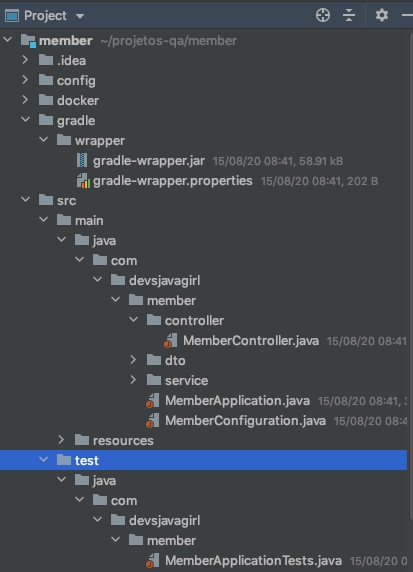
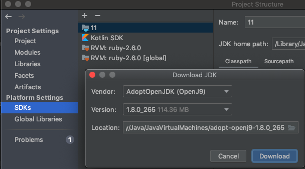
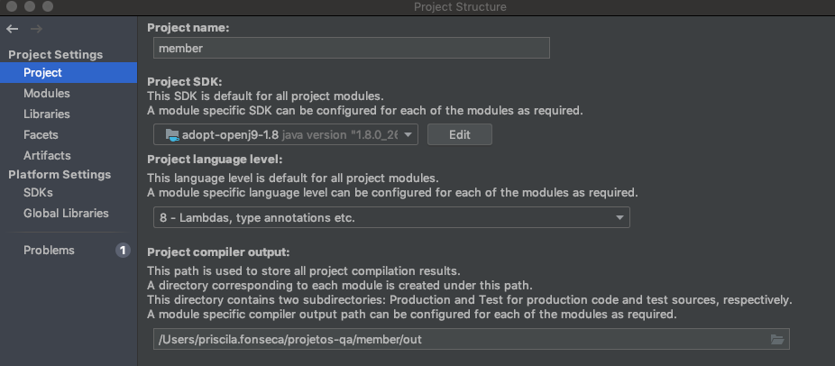

# Member

Este projeto tem o objetivo de ser construido em conjunto pelas integrantes da comunidade.

## Documentação Extra 

https://miro.com/welcomeonboard/2eFlNakfRm4K3fLK5MEOWfteL0jPS8RpcxKmNpRHJRSFexij22IJ4FBYjOn5BYOs

### Prerequisites

What things you need to install the software and how to install them

```
Give examples
```

### Installing

A step by step series of examples that tell you how to get a development env running

Say what the step will be

```
Give the example
```

And repeat

```
until finished
```

End with an example of getting some data out of the system or using it for a little demo

## Problemas com o JDK

Ao importar o projeto no intelliJ aparecerá o seguinte pop-up: selecione a primeira opção "Import Gradle Project".


Entretanto, pode ser que o IntelliJ não consiga reconhecer corretamente o projeto e as pastas fiquem assim:



Isso pode acontecer devido ao fato das suas JDK's estarem corrompidas. 
Para solucionar esse problema baixe uma nova JDK e também será necessário configura-la em 3 lugares distintos.
Para isso vá em `File > Project Structure`. Na opção SDKs, clique no `+` e adicione o Java 8 do vendor doptOpenJDK (OpenJ9): 



Após baixar o novo JDK, vá à opção `Project` e selecione-o:



Selecione o novo JDK na opção `Modules`:


Verifique também qual SDK está selecionado em `IntelliJ > Preferences > Build, Execution, Deployment > Build Tools > Gradle`


Caso o IntelliJ não consiga indexar sozinho com as novas configurações, será necessário fechar o projeto em `File > Close Project`.
E também remover da janela de abertura do Intellij para então reabri-lo novamente.


## BOAS PRÁTICAS COM O GIT
 - Antes de começar a trabalhar na sua branch faça:
    - git fetch origin
    - git checkout master
    - git pull master
    - git checkout (sua branch)
    - git rebase master
 
 Atualizar suas branch local e manter ela atualizada com a master.

## Running the tests

Explain how to run the automated tests for this system

### Break down into end to end tests

Explain what these tests test and why

```
Give an example
```

### And coding style tests

Explain what these tests test and why

```
Give an example
```

## Deployment

Add additional notes about how to deploy this on a live system

## Built With

* [Dropwizard](http://www.dropwizard.io/1.0.2/docs/) - The web framework used
* [Maven](https://maven.apache.org/) - Dependency Management
* [ROME](https://rometools.github.io/rome/) - Used to generate RSS Feeds

## Contributing

Please read [CONTRIBUTING.md](https://gist.github.com/PurpleBooth/b24679402957c63ec426) for details on our code of conduct, and the process for submitting pull requests to us.

## Versioning

We use [SemVer](http://semver.org/) for versioning. For the versions available, see the [tags on this repository](https://github.com/your/project/tags). 

## Authors

* **Billie Thompson** - *Initial work* - [PurpleBooth](https://github.com/PurpleBooth)

See also the list of [contributors](https://github.com/your/project/contributors) who participated in this project.

## License

This project is licensed under the MIT License - see the [LICENSE.md](LICENSE.md) file for details

## Acknowledgments

* Hat tip to anyone whose code was used
* Inspiration
* etc


